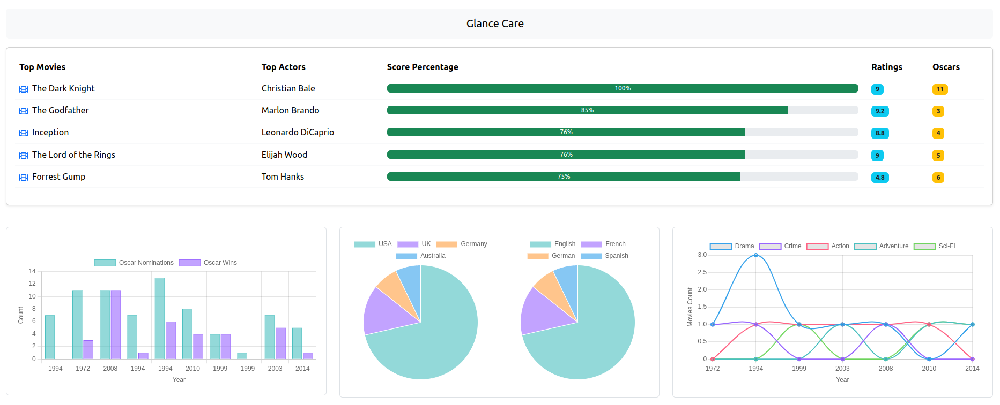
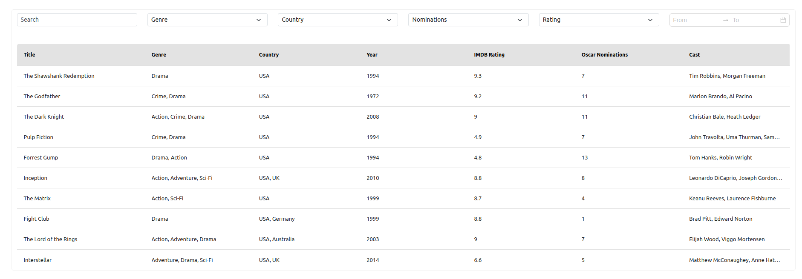
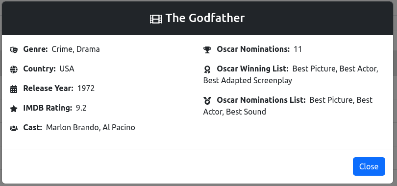
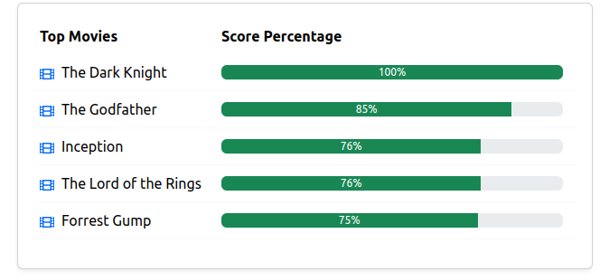
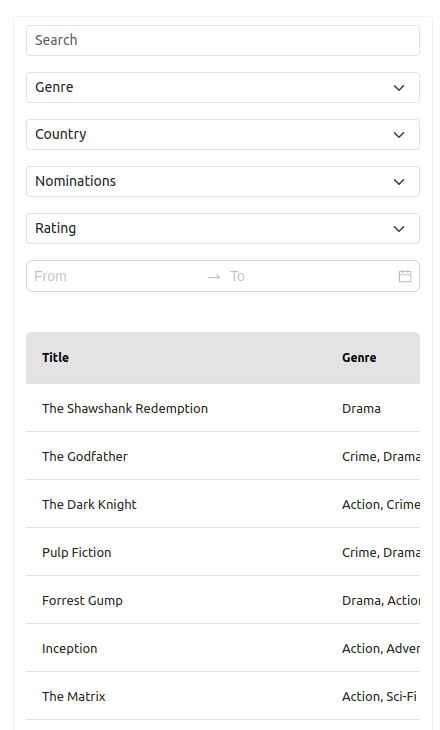
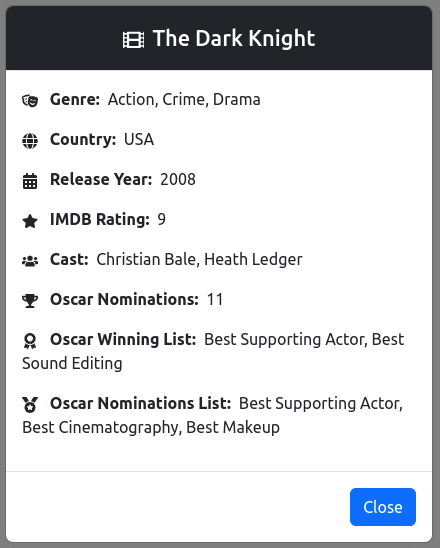

# Glance Care

## Project Setup

### git clone https://github.com/Glance-Care/frontend-assessment.git

### cd frontend-assessment

### npm i

### npm run start

Runs the app in the development mode.\
Open [http://localhost:3000](http://localhost:3000) to view it in your browser.

### Description

This project is a frontend-assessment for movies dashboard showing movies in listing and details along with charts, graphs and leaderboard for better visualization of the movies based on their title, genre, oscar nominees and wins, etc.

### Screenshots

